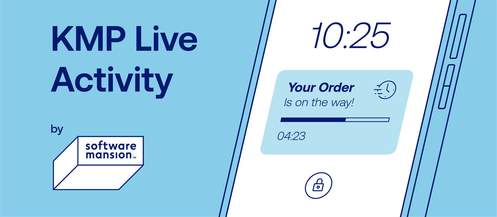

# KMP Live Activity




KMP Live Activity provides a Live Activity API for Kotlin&nbsp;Multiplatform.

## Getting started

### Kotlin Multiplatform module

Add the Kotlin Multiplatform library to the app&nbsp;module:

```toml
[versions]
kmpLiveActivity = "0.1.0"

[libraries]
swmansion-kmpLiveActivity = { module = "com.swmansion.kmpliveactivity:kmp-live-activity", version.ref = "kmpLiveActivity" }
```

```kts
commonMain.dependencies { api(libs.swmansion.kmpLiveActivity) }
```

Export it to the Kotlin framework. In a baseline project, this change looks as&nbsp;follows:

```diff
  listOf(iosArm64(), iosSimulatorArm64()).forEach { iosTarget ->
      iosTarget.binaries.framework {
          baseName = "ComposeApp"
          isStatic = true
+         export(libs.swmansion.kmpLiveActivity)
      }
  }
```

### iOS project

Open the iOS project in Xcode. Click the project entry in the navigator, select the app target
(usually `iosApp`), and open the Signing & Capabilities tab. If the Push Notifications capability is
not present, click the plus button, and double&zwj;-&zwj;click Push&nbsp;Notifications.

Edit the `Info.plist` file of the app target. Hover the cursor over Information Property List, click
the plus button, select Supports Live Activities, and set the value to&nbsp;`YES`.

Select File → New → Target. Select Widget Extension, and click Next. For Product Name, enter
`LiveActivity`. Ensure that Include Live Activity is checked and that the app target is selected for
Embed in Application. Click&nbsp;Finish.

Select File → Add Package Dependencies. In the search bar, enter
`https://github.com/software-mansion-labs/kmp-live-activity`. Set Dependency Rule to Exact Version,
and enter `0.1.0`. Ensure that the main project (usually `iosApp`) is selected for Add to Project,
and click Add Package. Under Add to Target, select the app target. Click Add Package. Add the
package to the `LiveActivity` target&nbsp;analogously.

In the `LiveActivity` target, delete the `LiveActivity.swift` and `LiveActivityLiveActivity.swift`
files. Replace the content of the remaining file, `LiveActivityBundle.swift`, with
the&nbsp;following:

```swift
import KMPLiveActivity
import SwiftUI
import WidgetKit

@main
struct LiveActivityBundle: WidgetBundle {
    var body: some Widget {
        LiveActivity()
    }
}
```

In the app target, open the file with the `App` implementation (usually `iOSApp.swift`). Import the
Kotlin framework (usually `ComposeApp`) and `KMPLiveActivity`. Add the following&nbsp;extension:

```swift
extension NativeLiveActivityManagerImpl: @retroactive NativeLiveActivityManager {}
```

If the `App` implementation has no initializer, add one. Paste the following&nbsp;inside:

```swift
LiveActivityManager.shared.bind(nativeManager: NativeLiveActivityManagerImpl.shared)
```

In a baseline project, these changes look as&nbsp;follows:

```diff
+ import ComposeApp
+ import KMPLiveActivity
  import SwiftUI
+
+ extension NativeLiveActivityManagerImpl: @retroactive NativeLiveActivityManager {}

  @main
  struct iOSApp: App {
      var body: some Scene {
          WindowGroup {
              ContentView()
          }
      }
+
+     init() {
+         LiveActivityManager.shared.bind(nativeManager: NativeLiveActivityManagerImpl.shared)
+     }
  }
```

When updating KMP Live Activity, keep the versions of the Kotlin Multiplatform library and the Swift
package in&nbsp;sync.

## Usage

Start a Live&nbsp;Activity:

```kt
val activityID =
    LiveActivityManager.start(
        LiveActivityAttributes.ContentState(/* ... */),
        LiveActivityAttributes(/* ... */),
    )
```

Update a Live&nbsp;Activity:

```kt
LiveActivityManager.update(activityID, LiveActivityAttributes.ContentState(/* ... */))
```

End a Live&nbsp;Activity:

```kt
LiveActivityManager.end(activityID, LiveActivityAttributes.ContentState(/* ... */))
```

See [the API reference](https://software-mansion-labs.github.io/kmp-live-activity/) and
[the sample app](https://github.com/software-mansion-labs/kmp-live-activity/tree/main/sample)
for&nbsp;more.

## By [Software Mansion](https://swmansion.com)

Founded in 2012, [Software Mansion](https://swmansion.com) is a software agency with experience in
building web and mobile apps. We are core React Native contributors and experts in dealing with all
kinds of React Native issues. We can help you build your next dream
product&zwj;—&zwj;[hire&nbsp;us](https://swmansion.com/contact/projects?utm_source=kmp-live-activity&utm_medium=readme).

[](https://swmansion.com)

[](https://github.com/software-mansion-labs/kmp-live-activity/graphs/contributors)
